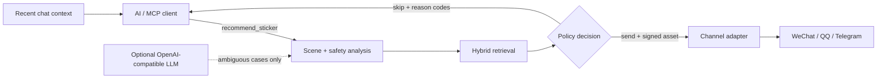

# ssticker-mcp

**A self-hosted MCP server that decides when a chat agent should send a sticker — and when it should stay quiet.**

[简体中文](./README.zh-CN.md) · [Deployment](./docs/DEPLOYMENT.md) · [Adapter SDK](./docs/ADAPTERS.md) · [Privacy](./docs/PRIVACY.md)

[](https://github.com/T1anjiu/ssticker-mcp/actions/workflows/ci.yml)
[](https://github.com/T1anjiu/ssticker-mcp/releases)
[](./LICENSE)
[](https://modelcontextprotocol.io)
[](https://nodejs.org)

ssticker-mcp turns recent chat context into a structured `send` or `skip` decision. It classifies the scene and tone, applies safety rules and cooldowns, retrieves a channel-compatible asset, and explains the result with stable reason codes.

It does **not** send messages to WeChat, QQ, Telegram, or any other platform. Delivery stays in your channel adapter, so platform credentials never enter the recommendation service.

> Current status: `0.1.0-alpha.0`. The project is usable end to end, but interfaces may still evolve before 1.0.

## Why ssticker-mcp

| Capability | What it gives you |
| --- | --- |
| Safety-first decisions | Serious or sensitive context, low confidence, cooldowns, and recent duplicates produce an explicit `skip`. |
| Explainable output | Every decision includes a scene, confidence, policy snapshot, and machine-readable `reason_codes`. |
| Local-first retrieval | SQLite FTS5 and sqlite-vec are combined with reciprocal-rank fusion; no hosted database is required. |
| Graceful degradation | The local multilingual E5 model falls back to deterministic hash embeddings, and the optional LLM classifier falls back to rules. |
| Channel-aware assets | Imported media is processed into variants that match Telegram, QQ, WeCom, WeChat Official Account, or a generic profile. |
| Operations console | Review assets, edit metadata and policies, inspect decisions, and check system health from `/admin`. |
| Privacy by design | Raw conversations are not persisted; session IDs are HMAC-stamped and signed asset URLs expire after five minutes. |

## How it works



The MCP server selects and describes an asset. Your adapter downloads the signed URL, calls the platform API, and reports the outcome back to ssticker-mcp.

## Quick start with Docker

The development Compose file binds only to `127.0.0.1:3377` on the host. It is intended for local evaluation, not public deployment.

```bash
docker compose up -d --build
docker compose exec ssticker node dist/cli.js catalog import examples/manifest.yaml
docker compose exec ssticker node dist/cli.js admin token create local-admin
```

Then:

1. Open [http://127.0.0.1:3377/admin](http://127.0.0.1:3377/admin).
2. Sign in with the token printed by the previous command. The token is shown only once.
3. Review and approve the imported demo stickers. Approved items are reindexed automatically.
4. Connect an MCP client to `http://127.0.0.1:3377/mcp`.

Check readiness with:

```bash
curl http://127.0.0.1:3377/health/ready
```

For an internet-facing deployment, use [`compose.prod.yaml`](./compose.prod.yaml) behind a TLS reverse proxy and follow the [production checklist](./docs/DEPLOYMENT.md#production-checklist).

## Run from source

Requirements:

- Node.js 24 or newer
- pnpm 10 through Corepack
- Optional: `ffmpeg` for animated GIF processing

```bash
corepack enable
pnpm install --frozen-lockfile
pnpm run build

node dist/cli.js init
node dist/cli.js catalog import examples/manifest.yaml
node dist/cli.js catalog validate
node dist/cli.js admin token create local-admin
node dist/cli.js serve
```

The service starts at [http://127.0.0.1:3377](http://127.0.0.1:3377). Open `/admin`, approve the demo assets, and connect your MCP client to `/mcp`.

The server works without a downloaded model by falling back to hash embeddings. To use the configured local E5 model instead, download it and rebuild the index:

```bash
node dist/cli.js models pull
node dist/cli.js index rebuild
```

## Connect an MCP client

### Streamable HTTP

Use this while `ssticker serve` or Docker Compose is running:

```json
{
  "mcpServers": {
    "ssticker": {
      "type": "streamable-http",
      "url": "http://127.0.0.1:3377/mcp"
    }
  }
}
```

Some clients infer the transport from the URL and do not require the `type` field.

### stdio

Use absolute paths so the MCP client and CLI share the intended data directory:

```json
{
  "mcpServers": {
    "ssticker": {
      "command": "node",
      "args": [
        "C:/absolute/path/to/ssticker-mcp/dist/cli.js",
        "mcp",
        "--stdio"
      ],
      "env": {
        "SSTICKER_DATA_DIR": "C:/absolute/path/to/ssticker-mcp/data"
      }
    }
  }
}
```

Replace the example paths with paths on your machine. stdio starts a loopback asset server because recommended assets are delivered through short-lived signed URLs.

## MCP contract

### Tools

| Tool | OIDC scope | Purpose |
| --- | --- | --- |
| `recommend_sticker` | `ssticker.recommend` | Return `send` or `skip`, scene analysis, policy state, reason codes, and an optional compatible asset. |
| `search_stickers` | `ssticker.catalog.read` | Search approved assets without automatic-send cooldowns. |
| `get_sticker_asset` | `ssticker.catalog.read` | Refresh a compatible asset and its five-minute signed URL. |
| `report_sticker_outcome` | `ssticker.feedback` | Idempotently record `sent`, `skipped`, `failed`, or `rejected`. |

Always respect `action: "skip"`. After an adapter attempts delivery, call `report_sticker_outcome` with a stable `outcome_event_id`.

Common skip reasons include `low_confidence`, `ambiguous_scene`, `serious_context`, `safety_blocked`, `cooldown_active`, `recent_duplicate`, and `no_compatible_asset`.

### Resources

- `ssticker://scenes` — enabled bilingual scene taxonomy
- `ssticker://stickers/{sticker_id}` — approved sticker metadata and variants
- `ssticker://policies/{profile}` — public thresholds and cooldown settings

## Channel adapters

Reference adapters are included for:

- Telegram Bot API
- QQ Official Bot
- WeCom group-bot webhooks
- WeChat Official Account customer-service messages

Adapters implement a small `ChannelAdapter` interface and own all platform credentials. See the [adapter guide](./docs/ADAPTERS.md) for the interface, payload behavior, and capability profiles.

## Configuration

The CLI reads the process environment directly. Docker Compose reads values from `.env`; when running from source, export variables in your shell or configure them in your process manager.

| Variable | Default | Description |
| --- | --- | --- |
| `SSTICKER_HOST` / `SSTICKER_PORT` | `127.0.0.1` / `3377` | HTTP bind address. |
| `SSTICKER_DATA_DIR` | `./data` | SQLite database, assets, uploads, models, and generated secrets. |
| `SSTICKER_PUBLIC_BASE_URL` | Derived from host and port | Base URL embedded in signed asset links. Set an HTTPS URL in production. |
| `SSTICKER_ALLOWED_ORIGINS` | Public base URL + localhost | Comma-separated allowed browser origins. |
| `SSTICKER_AUTH_MODE` | `none` | `none` for loopback development or `oidc` for remote access. |
| `SSTICKER_OIDC_ISSUER` / `_AUDIENCE` / `_JWKS_URL` | — | Required together when OIDC is enabled. |
| `SSTICKER_SIGNING_SECRET` / `SSTICKER_SESSION_SECRET` | Generated locally | Separate secrets of at least 32 bytes; explicit values are required by production Compose. |
| `SSTICKER_EMBEDDING_PROVIDER` | `local` | `local` or `hash`; development Compose uses `hash`. |
| `SSTICKER_MODEL_ID` | `intfloat/multilingual-e5-small` | Hugging Face model used by the local embedding provider. |
| `SSTICKER_LLM_BASE_URL` / `_API_KEY` / `_MODEL` | — | Optional OpenAI-compatible classifier; base URL and model must be set together. |
| `SSTICKER_LOG_LEVEL` | `info` | Pino log level; `silent` disables application logs. |

See [`.env.example`](./.env.example) for the complete template.

> The server refuses a non-loopback bind with `SSTICKER_AUTH_MODE=none` unless `SSTICKER_ALLOW_INSECURE_REMOTE=true` is explicitly set. That escape hatch is for development only.

## CLI reference

After `pnpm run build`, use `node dist/cli.js <command>` from the repository root.

| Command | Purpose |
| --- | --- |
| `init` | Initialize directories, SQLite schema, profiles, and persistent secrets. |
| `models pull` | Download the configured local embedding model. |
| `catalog import <path>` | Import a directory or YAML, JSON, or JSONL manifest. |
| `catalog validate` | Validate metadata, safety, scenes, and generated variants. |
| `catalog review <id>` | Approve one sticker; add `--deny` to block it. |
| `index rebuild` | Rebuild and atomically swap the search index. |
| `admin token create [name]` | Create a one-time-visible admin token. |
| `backup create [path]` / `backup restore <path>` | Back up or restore the complete data directory. |
| `doctor` | Check SQLite, sqlite-vec, Sharp, ffmpeg, profiles, and model cache. |

## Security and privacy defaults

- Raw conversation text and attachments are never written to SQLite, logs, metrics, or health responses.
- Plaintext `session_id` values are HMAC-stamped before a decision event is stored.
- Pino redaction covers messages, session IDs, authorization headers, tokens, API keys, and download URLs.
- Asset URLs are HMAC-SHA256 signed and expire after five minutes.
- The optional LLM receives conversation text only — never session IDs, attachments, credentials, or signed URLs.
- Remote HTTP deployments support OIDC/JWKS and Protected Resource Metadata.

Read the full [privacy model](./docs/PRIVACY.md), [deployment guide](./docs/DEPLOYMENT.md), and [security policy](./SECURITY.md) before a production rollout.

## Development

```bash
pnpm run check       # lint + typecheck + unit/integration tests + build
pnpm run test:e2e    # Playwright + axe checks for the admin console
pnpm run eval        # bilingual recommendation quality gates
pnpm run benchmark   # 50k-item retrieval benchmark
```

Repository map:

| Path | Responsibility |
| --- | --- |
| `src/mcp/` | MCP tools and resources |
| `src/services/` | Catalog, decisions, embeddings, auth, media, metrics, and jobs |
| `src/db/` | SQLite, Drizzle schema, FTS5, and sqlite-vec |
| `src/adapters/` | Adapter SDK and reference channel implementations |
| `apps/admin/` | React + Vite operations console |
| `profiles/` | Channel capabilities and recommendation policies |
| `examples/` | Demo catalog, assets, and licensing notes |
| `tests/`, `e2e/`, `eval/` | Automated tests, accessibility checks, and evaluation corpus |

Contributions are welcome. Start with [CONTRIBUTING.md](./CONTRIBUTING.md), review the [Code of Conduct](./CODE_OF_CONDUCT.md), and see [CHANGELOG.md](./CHANGELOG.md) for release history.

## License

Code is licensed under [Apache-2.0](./LICENSE). Imported sticker assets retain their own licenses; see [`examples/ASSET-LICENSE.md`](./examples/ASSET-LICENSE.md) and preserve attribution when required.
