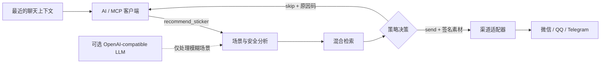

# ssticker-mcp

**一个自托管的 MCP 表情包决策服务：知道什么时候该发，也知道什么时候该保持安静。**

[English](./README.md) · [部署指南](./docs/DEPLOYMENT.md) · [适配器 SDK](./docs/ADAPTERS.md) · [隐私说明](./docs/PRIVACY.md)

[](https://github.com/T1anjiu/ssticker-mcp/actions/workflows/ci.yml)
[](https://github.com/T1anjiu/ssticker-mcp/releases)
[](./LICENSE)
[](https://modelcontextprotocol.io)
[](https://nodejs.org)

ssticker-mcp 把最近的聊天上下文转换成结构化的 `send` 或 `skip` 决策。它会识别场景与语气、执行安全规则和频控、检索符合渠道限制的素材，并用稳定的原因码解释结果。

它**不会**直接向微信、QQ、Telegram 或其他平台发送消息。真正的发送动作由你的渠道适配器完成，因此平台凭证不会进入推荐服务。

> 当前版本：`0.1.0-alpha.0`。项目已经可以端到端运行，但 1.0 之前接口仍可能调整。

## 为什么选择 ssticker-mcp

| 能力 | 你会得到什么 |
| --- | --- |
| 安全优先的决策 | 严肃或敏感语境、低置信度、频控和近期重复都会得到明确的 `skip`。 |
| 可解释的结果 | 每次决策都包含场景、置信度、策略快照和机器可读的 `reason_codes`。 |
| 本地优先的检索 | SQLite FTS5 与 sqlite-vec 通过 RRF 融合，无需托管数据库。 |
| 可控的降级路径 | 本地多语言 E5 不可用时回退到确定性 hash 嵌入；可选 LLM 不可用时回退到规则。 |
| 渠道兼容的素材 | 导入素材会生成适配 Telegram、QQ、企微、微信公众号或通用配置的变体。 |
| 完整的运营后台 | 在 `/admin` 审核素材、编辑元数据和策略、查看决策记录与系统状态。 |
| 隐私默认保护 | 不持久化原始对话；会话 ID 经 HMAC 处理，签名素材 URL 五分钟后失效。 |

## 工作流程



MCP 服务只负责选择并描述素材。渠道适配器下载签名 URL、调用平台 API，再把发送结果回报给 ssticker-mcp。

## 使用 Docker 快速开始

开发版 Compose 只把服务绑定到宿主机的 `127.0.0.1:3377`，适合本地体验，不应直接用于公网部署。

```bash
docker compose up -d --build
docker compose exec ssticker node dist/cli.js catalog import examples/manifest.yaml
docker compose exec ssticker node dist/cli.js admin token create local-admin
```

然后：

1. 打开 [http://127.0.0.1:3377/admin](http://127.0.0.1:3377/admin)。
2. 使用上一条命令输出的令牌登录；令牌只会显示一次。
3. 在后台审核并启用导入的演示表情，启用后会自动重建对应索引。
4. 将 MCP 客户端连接到 `http://127.0.0.1:3377/mcp`。

检查服务是否就绪：

```bash
curl http://127.0.0.1:3377/health/ready
```

如果要部署到公网，请在 TLS 反向代理后使用 [`compose.prod.yaml`](./compose.prod.yaml)，并逐项完成[生产检查清单](./docs/DEPLOYMENT.md#production-checklist)。

## 从源码运行

环境要求：

- Node.js 24 或更高版本
- 通过 Corepack 使用 pnpm 10
- 可选：处理 GIF 动图所需的 `ffmpeg`

```bash
corepack enable
pnpm install --frozen-lockfile
pnpm run build

node dist/cli.js init
node dist/cli.js catalog import examples/manifest.yaml
node dist/cli.js catalog validate
node dist/cli.js admin token create local-admin
node dist/cli.js serve
```

服务会启动在 [http://127.0.0.1:3377](http://127.0.0.1:3377)。打开 `/admin` 并启用演示素材，然后将 MCP 客户端连接到 `/mcp`。

即使没有下载模型，服务也会回退到 hash 嵌入并正常运行。如果希望使用配置的本地 E5 模型，请下载模型并重建索引：

```bash
node dist/cli.js models pull
node dist/cli.js index rebuild
```

## 连接 MCP 客户端

### Streamable HTTP

在 `ssticker serve` 或 Docker Compose 正在运行时使用：

```json
{
  "mcpServers": {
    "ssticker": {
      "type": "streamable-http",
      "url": "http://127.0.0.1:3377/mcp"
    }
  }
}
```

部分客户端可以根据 URL 自动识别传输方式，不需要 `type` 字段。

### stdio

请使用绝对路径，确保 MCP 客户端和 CLI 访问同一个数据目录：

```json
{
  "mcpServers": {
    "ssticker": {
      "command": "node",
      "args": [
        "C:/absolute/path/to/ssticker-mcp/dist/cli.js",
        "mcp",
        "--stdio"
      ],
      "env": {
        "SSTICKER_DATA_DIR": "C:/absolute/path/to/ssticker-mcp/data"
      }
    }
  }
}
```

请把示例路径替换成你机器上的实际路径。stdio 会同时启动一个仅监听回环地址的素材服务，因为推荐结果通过短时签名 URL 交付。

## MCP 契约

### 工具

| 工具 | OIDC Scope | 用途 |
| --- | --- | --- |
| `recommend_sticker` | `ssticker.recommend` | 返回 `send` 或 `skip`、场景分析、策略状态、原因码和可选的兼容素材。 |
| `search_stickers` | `ssticker.catalog.read` | 搜索已审核素材，不应用自动发送频控。 |
| `get_sticker_asset` | `ssticker.catalog.read` | 重新选择兼容变体，并刷新五分钟有效的签名 URL。 |
| `report_sticker_outcome` | `ssticker.feedback` | 幂等记录 `sent`、`skipped`、`failed` 或 `rejected`。 |

必须始终遵守 `action: "skip"`。渠道适配器尝试发送后，应使用稳定的 `outcome_event_id` 调用 `report_sticker_outcome`。

常见跳过原因包括 `low_confidence`、`ambiguous_scene`、`serious_context`、`safety_blocked`、`cooldown_active`、`recent_duplicate` 和 `no_compatible_asset`。

### 资源

- `ssticker://scenes` — 已启用的中英双语场景分类
- `ssticker://stickers/{sticker_id}` — 已启用表情的元数据与素材变体
- `ssticker://policies/{profile}` — 可公开读取的阈值与频控设置

## 渠道适配器

仓库包含以下参考实现：

- Telegram Bot API
- QQ 官方机器人
- 企业微信群机器人 Webhook
- 微信公众号客服消息

适配器实现精简的 `ChannelAdapter` 接口，并独立持有全部平台凭证。接口定义、发送行为和渠道能力配置请参阅[适配器指南](./docs/ADAPTERS.md)。

## 配置

CLI 直接读取进程环境变量。Docker Compose 会读取 `.env`；从源码运行时，请在 Shell 中导出变量，或通过进程管理器注入。

| 变量 | 默认值 | 说明 |
| --- | --- | --- |
| `SSTICKER_HOST` / `SSTICKER_PORT` | `127.0.0.1` / `3377` | HTTP 监听地址。 |
| `SSTICKER_DATA_DIR` | `./data` | SQLite、素材、上传文件、模型和生成的密钥。 |
| `SSTICKER_PUBLIC_BASE_URL` | 根据 host 和 port 生成 | 写入签名素材链接的基础地址；生产环境应设置为 HTTPS URL。 |
| `SSTICKER_ALLOWED_ORIGINS` | 公共地址 + localhost | 允许的浏览器 Origin，多个值用逗号分隔。 |
| `SSTICKER_AUTH_MODE` | `none` | 回环地址开发使用 `none`，远程访问使用 `oidc`。 |
| `SSTICKER_OIDC_ISSUER` / `_AUDIENCE` / `_JWKS_URL` | — | 启用 OIDC 时必须同时配置。 |
| `SSTICKER_SIGNING_SECRET` / `SSTICKER_SESSION_SECRET` | 本地自动生成 | 两个不同且不少于 32 字节的密钥；生产 Compose 要求显式设置。 |
| `SSTICKER_EMBEDDING_PROVIDER` | `local` | 可选 `local` 或 `hash`；开发版 Compose 使用 `hash`。 |
| `SSTICKER_MODEL_ID` | `intfloat/multilingual-e5-small` | 本地嵌入使用的 Hugging Face 模型。 |
| `SSTICKER_LLM_BASE_URL` / `_API_KEY` / `_MODEL` | — | 可选 OpenAI-compatible 分类器；Base URL 与模型必须一起设置。 |
| `SSTICKER_LOG_LEVEL` | `info` | Pino 日志级别；`silent` 可关闭应用日志。 |

完整模板见 [`.env.example`](./.env.example)。

> 当 `SSTICKER_AUTH_MODE=none` 时，服务默认拒绝监听非回环地址。只有显式设置 `SSTICKER_ALLOW_INSECURE_REMOTE=true` 才会放行；该选项仅用于开发。

## CLI 常用命令

执行 `pnpm run build` 后，在仓库根目录使用 `node dist/cli.js <command>`。

| 命令 | 用途 |
| --- | --- |
| `init` | 初始化目录、SQLite 表结构、配置档案和持久化密钥。 |
| `models pull` | 下载配置的本地嵌入模型。 |
| `catalog import <path>` | 导入目录或 YAML、JSON、JSONL 清单。 |
| `catalog validate` | 检查元数据、安全级别、场景和生成的素材变体。 |
| `catalog review <id>` | 启用一个表情；添加 `--deny` 可将其封禁。 |
| `index rebuild` | 重建搜索索引并原子切换。 |
| `admin token create [name]` | 创建一个只显示一次的后台登录令牌。 |
| `backup create [path]` / `backup restore <path>` | 备份或恢复完整数据目录。 |
| `doctor` | 检查 SQLite、sqlite-vec、Sharp、ffmpeg、配置档案和模型缓存。 |

## 默认安全与隐私策略

- 原始对话文本和附件不会写入 SQLite、日志、指标或健康检查响应。
- `session_id` 在决策事件入库前会经过 HMAC 处理，不保存明文。
- Pino 会脱敏消息、会话 ID、Authorization Header、令牌、API Key 和下载 URL。
- 素材 URL 使用 HMAC-SHA256 签名，五分钟后失效。
- 可选 LLM 只接收对话文本，不接收会话 ID、附件、凭证或签名 URL。
- 远程 HTTP 部署支持 OIDC/JWKS 与 Protected Resource Metadata。

生产部署前，请完整阅读[隐私说明](./docs/PRIVACY.md)、[部署指南](./docs/DEPLOYMENT.md)和[安全策略](./SECURITY.md)。

## 开发与验证

```bash
pnpm run check       # lint + 类型检查 + 单元/集成测试 + 构建
pnpm run test:e2e    # 管理后台的 Playwright + axe 检查
pnpm run eval        # 中英双语推荐质量门槛
pnpm run benchmark   # 5 万条素材的检索基准
```

项目结构：

| 路径 | 职责 |
| --- | --- |
| `src/mcp/` | MCP 工具与资源 |
| `src/services/` | 素材库、决策、嵌入、鉴权、媒体、指标与任务 |
| `src/db/` | SQLite、Drizzle Schema、FTS5 与 sqlite-vec |
| `src/adapters/` | 适配器 SDK 与参考渠道实现 |
| `apps/admin/` | React + Vite 运营后台 |
| `profiles/` | 渠道能力与推荐策略 |
| `examples/` | 演示素材库、资源和授权说明 |
| `tests/`、`e2e/`、`eval/` | 自动化测试、无障碍检查和评测语料 |

欢迎贡献。请先阅读 [CONTRIBUTING.md](./CONTRIBUTING.md) 和[行为准则](./CODE_OF_CONDUCT.md)，版本记录见 [CHANGELOG.md](./CHANGELOG.md)。

## 许可证

代码使用 [Apache-2.0](./LICENSE) 许可证。导入的表情素材保留各自许可证；请查看 [`examples/ASSET-LICENSE.md`](./examples/ASSET-LICENSE.md)，并按要求保留署名。
